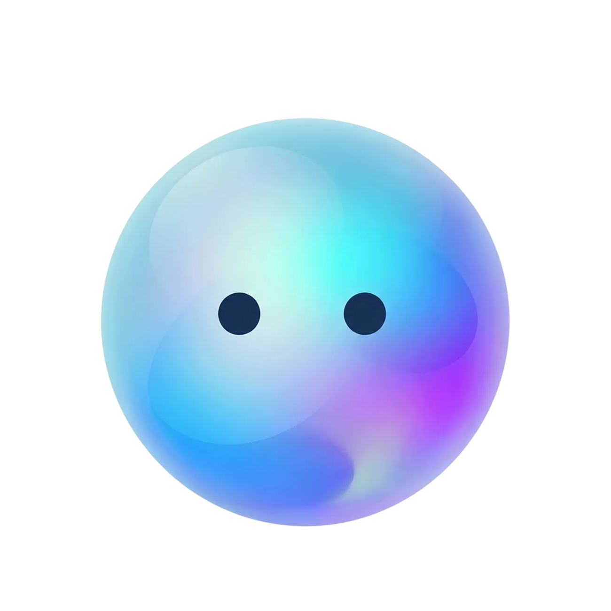

# 🫧 Bubly - Official Website

<p align="center">
  
</p>

<p align="center">
  <strong>The Official Website for Bubly - Your AI-Powered Social Assistant</strong>
</p>

<p align="center">
  <a href="https://apps.apple.com/us/app/bubly-social-assistant/id6754884488">
    
  </a>
  
  
</p>

---

## 📱 About Bubly

**Bubly** is an intelligent social relationship management app that helps you nurture meaningful connections. Never forget another birthday, anniversary, or special moment again.

### ✨ Key Features
- 🧠 **AI-Powered Greetings** - Generate personalized messages for any occasion
- 📅 **Smart Reminders** - Never miss important dates
- 👥 **Contact Management** - Organize relationships with custom categories
- 🔒 **Privacy-First** - Your data stays on your device

---

## 🌐 Website Overview

This repository contains the official Bubly website, showcasing the app's features with:

- **Interactive AI Demo** - Try the AI greeting generator
- **Feature Showcase** - Explore all capabilities
- **Team Introduction** - Meet the Development Squad
- **Modern Design** - Glassmorphism with smooth animations

### 🎨 Design System
| Element        | Style                                           |
| -------------- | ----------------------------------------------- |
| **Colors**     | Sky Blue → Violet → Pink gradient               |
| **Effects**    | Glassmorphism, 3D parallax, particle animations |
| **Mascot**     | Bubbo - Interactive animated character          |
| **Typography** | Plus Jakarta Sans                               |

---

## 🚀 Quick Start

### Prerequisites
- Node.js 18+ (LTS recommended)
- npm or yarn

### Installation

```bash
# Clone the repository
git clone https://github.com/your-org/bubbo-s-world.git
cd bubbo-s-world

# Install dependencies
npm install

# Start development server
npm run dev
```

The dev server runs at `http://localhost:8080`

### Build for Production

```bash
# Build
npm run build

# Preview build
npm run preview
```

Output: `dist/` folder

---

## 📁 Project Structure

```
bubbo-s-world/
├── src/
│   ├── assets/                    # Images & media
│   │   ├── app-screenshot-*.png   # App screenshots
│   │   ├── bubbo-*.png            # Bubbo mascot variants
│   │   └── app-qrcode.png         # App Store QR code
│   │
│   ├── components/                # React components
│   │   ├── AIAssistantDemo.tsx    # Interactive AI demo
│   │   ├── TeamSection.tsx        # Development Squad showcase
│   │   ├── TestimonialsSection.tsx # Featured feedback
│   │   ├── GettingStarted.tsx     # Onboarding guide
│   │   ├── BubboGallery.tsx       # Mascot gallery
│   │   ├── InteractiveBubbo.tsx   # Animated mascot
│   │   ├── PageLoader.tsx         # Loading animation
│   │   ├── Layout.tsx             # Page layout
│   │   ├── Navbar.tsx             # Navigation
│   │   └── ui/                    # shadcn/ui components
│   │
│   ├── pages/                     # Route pages
│   │   ├── Index.tsx              # Homepage
│   │   ├── Features.tsx           # Features showcase
│   │   ├── About.tsx              # About us + Team
│   │   ├── Contact.tsx            # Contact form
│   │   ├── Privacy.tsx            # Privacy Policy
│   │   └── Terms.tsx              # Terms of Service
│   │
│   ├── hooks/                     # Custom React hooks
│   ├── lib/                       # Utilities
│   ├── App.tsx                    # Root component
│   ├── index.css                  # Global styles
│   └── main.tsx                   # Entry point
│
├── public/                        # Static files
├── .github/workflows/             # CI/CD (GitHub Pages)
└── package.json
```

---

## 🛠 Tech Stack

| Category          | Technology                |
| ----------------- | ------------------------- |
| **Framework**     | React 18 + TypeScript     |
| **Build Tool**    | Vite 7                    |
| **Styling**       | Tailwind CSS 3            |
| **UI Components** | shadcn/ui (Radix UI)      |
| **Animations**    | Framer Motion             |
| **Routing**       | React Router v6           |
| **Icons**         | Lucide React              |
| **Deployment**    | GitHub Pages (Auto CI/CD) |

---

## 👥 Development Squad

| Name           | Role            | Focus                          |
| -------------- | --------------- | ------------------------------ |
| **Rebecca**    | Product Owner   | Product Vision & Strategy      |
| **Max**        | Project Manager | Sprint Planning & Automation   |
| **Lulalabana** | Lead Developer  | System Architecture & Core Dev |
| **Finn**       | UI/UX Designer  | Interface & Experience Design  |

---

## 🌐 Deployment

### GitHub Pages (Default)

Automatic deployment on push to `main`:

```bash
git add .
git commit -m "Your update message"
git push origin main
# Deploys automatically in 2-3 minutes
```

### Other Options

<details>
<summary>Vercel</summary>

```bash
npm i -g vercel
vercel
```
</details>

<details>
<summary>Netlify</summary>

```bash
npm run build
# Upload dist/ to Netlify
```
</details>

---

## 📋 Available Scripts

| Command           | Description              |
| ----------------- | ------------------------ |
| `npm run dev`     | Start development server |
| `npm run build`   | Build for production     |
| `npm run preview` | Preview production build |
| `npm run lint`    | Run ESLint               |

---

## 🎨 Bubbo Mascot Variants

| Pose                 | Usage                    |
| -------------------- | ------------------------ |
| `bubbo-logo.png`     | Default pose             |
| `bubbo-wave.png`     | Greeting animations      |
| `bubbo-thinking.png` | Loading states           |
| `bubbo-artist.png`   | Designer representation  |
| `bubbo-business.png` | PM representation        |
| `bubbo-vr.png`       | Developer representation |
| `bubbo-cool.png`     | Fun moments              |
| `bubbo-xmas-*.png`   | Holiday themes           |

---

## 📞 Links

- **App Store**: [Download Bubly](https://apps.apple.com/us/app/bubly-social-assistant/id6754884488)
- **Website**: Coming soon
- **Support**: Contact form on website

---

## 📄 License

Proprietary Software - All Rights Reserved © 2025 Bubly Team

---

## 📝 Changelog

### v1.4.0 (2026-02-22) 🎁 **Gift Finder & Content Refresh**

#### ✨ New Features
- **🎁 AI Gift Finder Demo** - Interactive 4-step gift recommendation flow on the homepage
  - Personalized results per contact (Rose / Owen / Zack) × budget tier
  - 12 contact-specific gift images (cozy / nice / sweet / wow)
  - Animated step progress indicator matching the Greeting Generator style
  - Loading animation with spinning gift emoji
- **💌 Greeting Generator Component** - Extracted into standalone `GreetingGenerator.tsx`
  - Progress step color logic unified with GiftFinder

#### 🔧 Improvements
- **Features Page** – Updated `mainFeatures` screenshots & descriptions for all five feature cards (Contact Management, Smart Reminders, Gift Finder, AI Greetings, Event Calendar); added four new app screenshots
- **Privacy Policy** – Content updated to February 2026; expanded sections on data collection, AI processing transparency, and GDPR/CCPA/PDPA rights
- **Terms of Service** – Content refreshed to February 2026 with clearer language

#### 🧹 Cleanup
- Removed unused generic gift placeholder images (`gift-cozy.png`, `gift-nice.png`, `gift-placeholder.png`, `gift-sweet.png`, `gift-wow.png`) in favour of contact-specific variants

---

### v1.3.0 (2025-12-26) 🎉 **Production Release**

#### ✨ New Features
- **🎮 Development Squad Section** - Esports-style team showcase
  - Hero player cards with 3D parallax
  - RPG-style stats (Strategy, Coding, Design, etc.)
  - Floating idle animations & particle effects
  - Holographic card shine effect
  - Team stats aggregation bar

- **📜 Legal Pages Redesign** - Privacy Policy & Terms of Service
  - Updated to December 2025
  - Professional icon-based sections
  - Quick summary banners
  - GDPR/CCPA compliant language
  - Branded visual design

#### 🔧 Improvements
- Enhanced page load animations
- Smoother scroll-to-top on navigation
- Optimized mobile responsiveness

---

### v1.2.3 (2025-12-26)
- 💬 Featured Feedback section with star ratings
- 🚀 Getting Started 3-step guide
- 🔧 Navigation scroll fix

### v1.2.2 (2025-12-26)
- 🎨 Hero Section mobile optimization
- ✨ New Bubbo loading animation
- 📱 Contact page simplification
- 🔧 About page Bubbo sizing fix

### v1.2.1 (2025-12-26)
- 🎨 Features page Bento Grid redesign
- ✨ Animated gradient borders
- 📱 Mobile layout improvements

### v1.2.0 (2025-12-26)
- 🚀 GitHub Pages auto-deployment
- 🎨 Official Bubbo Avatar logo
- ⚡ Vite 7 upgrade

### v1.1.0 (2025-12-26)
- ✨ Interactive AI Assistant Demo
- 🎨 Enhanced Bubbo animations
- 📱 Mobile experience improvements

### v1.0.0 (2024)
- 🎉 Initial release
- 🏠 Homepage design
- 📄 All feature pages

---

<p align="center">
  Made with 💝 by the Bubly Team
</p>
